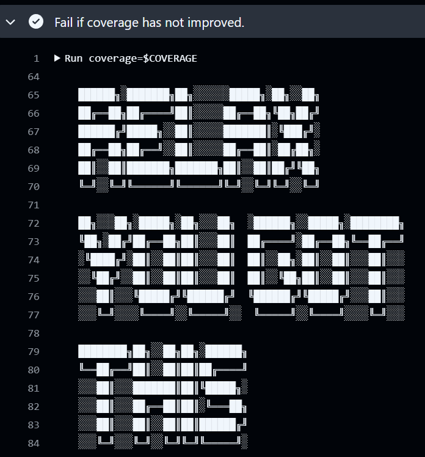
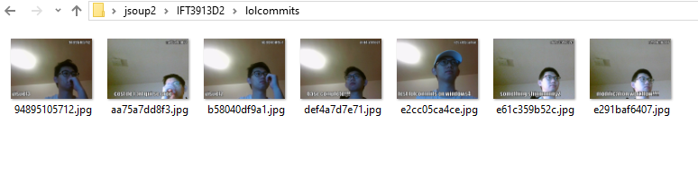

# Tâche #3: test sur divers environnements

---
## Table des matières
- [Flags](#Differents-flags)
- [Structure](#Structure)
- [Changement apportés à la Github action](#Changement-apportes-a-la-Github-action)
- [Justification des Flags](#Justification-des-Flags)
- [Qualité](#Qualité)
- [humour](#humour)
- [🎉🎁💎Bonus💎🎁🎉](#Bonus)
- [📚📝Bibliographie](#Bibliographie)
---

## Differents flags
- Gestion du garbage collector:
  - "-XX:+UseG1GC"                                    
- Diagnostic:
  - "-XX:+PrintGCDetails"               
- Gestion de la memoire:
  - "-XX:MaxHeapSize=512m"              
- Activation de fonctionnalités avancées:
  - "-XX:+UnlockExperimentalVMOptions"  
- Compilation JIT:
  - "-XX:+OptimizeStringConcat"
---

## Structure
- Voir github action
---

## Changement apportes a la Github action 
Au lieu de modifier les workflows existants, nous avons créé un nouveau workflow nommé jvm-flags-test.yml afin d'éviter 
les conflits visuels avec les workflows de la tâche 2. Nous avons gardé la structure du build.yml, mais avec certaines modifications et améliorations.

1. Configuration de la matrice de strategie

Nous avons ajouté la matrice jvm_flag (`matrice de stratégie`) qui permet d'exécuter un job plusieurs fois avec des 
configurations différentes. Voici les 5 flags dans la matrice

- "-XX:+UseG1GC", Lors de l'exécution, permet d'activer le garbage collector G1.
- "-XX:+PrintGCDetails", Lors de l'exécution, permet d'afficher les détails des événements de GC
- "-XX:MaxHeapSize=512m", Lors de l'exécution, limite la taille maximale du tas à 512 Mo
- "-XX:+UnlockExperimentalVMOptions", Lors de l'exécution, déverrouille les options expérimentales de la JVM.
- "-XX:+OptimizeStringConcat", Lors de l'exécution, optimise les opérations de concaténation de chaînes

Si nécessaire, nous pouvons également définir l'environnement ou la version de Java dans la matrice(dans notre cas, cela n'est pas nécessaire).

2. Execution des étapes du workflow

Voici un petit résumé des étapes qui seront exécutées pour chaque combinaison de la matrice :
- Checkout du code : Récupère le code source du repo pour l'utiliser.
- Configuration du JDK : Configure la version de Java.
- Application du flag JVM : Le flag JVM sélectionné est passé à la variable d'environnement MAVEN_OPTS, permettant ainsi son utilisation pendant l'exécution des tâches Maven.
- Compilation et tests : Exécute mvn compile test, puis la couverture est générée via JaCoCo.
- Analyse de la couverture des tests : 🔍Vérifie s'il y a une augmentation de la couverture. Si ce n'est pas le cas, l'étape échoue❌

3. Utilisation des Flags JVM

Comme mentionné plus haut, la variable d'environnement MAVEN_OPTS permet à Maven d'utiliser ces flags pour personnaliser la façon dont la JVM s'exécute pendant les étapes de compilation, de test et d'exécution.

En résumé, avec ces changements, nous pouvons collecter des données sur la couverture de code et mieux comprendre comment différents paramètres JVM affectent les tests et les performances.

---

## Justification des Flags
1. -XX:+UseG1GC
- **Performance** : Il permet dactiver le garbage collector G1, qui est super pour gérer la mémoire dans des applications avec beaucoup de données. Il essaie de limiter les pauses dues à la gestion de la mémoire, ce qui peut améliorer les performances.
- **Observabilité** : Il fournit beaucoup d'infos sur la gestion de la mémoire, donc on peut facilement voir si quelque chose ne va pas (comme des fuites de mémoire).
- **Pourquoi c'est choisi** : Il aide à tester la gestion de la mémoire et la performance. C'est utile pour voir comment un application réagit à des demandes de mémoire importantes.

2. -XX:+PrintGCDetails
- **Performance** : Ca peut légèrement ralentir l'application, car il y a plus de log à traiter, mais les infos sont super utiles pour comprendre ce qui se passe en arrière-plan.
- **Observabilité** : Il fait en sorte que la JVM affiche des détails sur le garbage collection dans les logs. On saura exactement combien de temps chaque étape du garbage collection prend, quelle est la taille de la mémoire avant et après chaque collecte, etc.
- **Pourquoi c'est choisi** : C'est vraiment utile pour avoir une vue détaillée de la gestion de la mémoire et de l'impact du garbage collection, surtout pendant les tests.

3. -XX:MaxHeapSize=512m
- **Performance** : Il fixe la taille maximale du tas mémoire à 512 Mo. Si le tas est trop petit, la JVM va devoir faire plus de garbage collection, ce qui peut ralentir l'application. Si le tas est trop grand, ça consomme plus de mémoire, ce qui peut aussi poser problème.
- **Observabilité** : En limitant la taille de la mémoire, on peut tester comment un application gère les ressources sous pression. C’est un bon moyen de détecter des fuites ou des problèmes de mémoire.
- **Pourquoi c'est choisi** : Il permet de tester l'application avec une taille de mémoire plus petite pour voir comment elle réagit sous contraintes.

4. -XX:+UnlockExperimentalVMOptions
- **Performance** :  Il permet d'activer des options expérimentales dans la JVM. C'est un peu risqué, car ces options ne sont pas toujours stables, mais elles peuvent offrir des optimisations intéressantes.
- **Observabilité** :  Ces options peuvent être moins fiables, donc ce flag n'est pas toujours conseillé en production, mais c'est un moyen d'explorer des améliorations avant qu'elles soient officiellement intégrées
- **Pourquoi c'est choisi** : Il permet de tester de nouvelles fonctionnalités qui pourraient améliorer les performances, même si elles ne sont pas encore entièrement prêtes.
 
5. -XX:+OptimizeStringConcat
- **Performance** : Il optimise la concaténation des chaînes de caractères. Par défaut, la JVM crée des objets temporaires pour chaque concaténation, ce qui peut être lent si on fait beaucoup de manipulations de chaînes. Ce flag permet de rendre cette opération plus rapide.
- **Observabilité** : L'optimisation rend les choses plus rapides, mais parfois elle cache ce qui se passe sous le capot. Cependant, ça n'affecte généralement pas la qualité du code.
- **Pourquoi c'est choisi** : Si un application travaille beaucoup avec des chaînes de caractères, ce flag peut vraiment améliorer les performances.
 
---

## Qualité
- Voir github action
---

## humour
- Voir github action, voici un exemple 😎:
- 
---

## Bonus
- 
- Path pour les images de lolcommits: `src/test/java/org/jsoup/IFT3913D2/lolcommits/`
---

## Bibliographie
- [Oracle](https://www.oracle.com/java/technologies/javase/vmoptions-jsp.html)
- [bellsoft](https://bell-sw.com/blog/guide-to-jvm-memory-configuration-options/)
- [Text Art](https://fsymbols.com/text-art/)
---