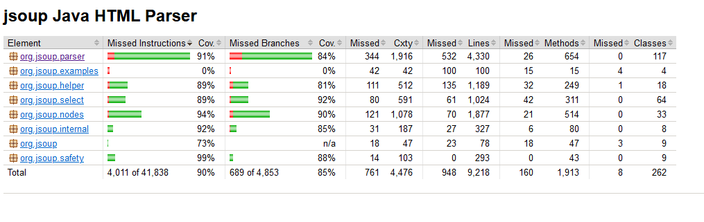

# Documentation des Tests Unitaires

## Emplacement du Test - Méthode close()
- **Visuel à partir de GitHub** : [Lien vers le test](https://github.com/Dietetics/jsoup/blob/5db594630b7972d015520a56f861c8d89d5170a2/src/test/java/org/jsoup/parser/myCharacterReaderTest.java)
- Path détaillé à partir de la racine de contenu: `src/test/java/org/jsoup/parser/myCharacterReaderTest.java`

Les tests pour la méthode `close()` se trouvent dans la classe `myCharacterReaderTest`, fichier `myCharacterReaderTest.java`. 
Le test particulier pour la branche `if (reader == null)` est documenté sous le nom `testClose_WhenReaderIsNull_ReturnsImmediately`.

## Méthodes Testées
- **`close()`** : Cette méthode est testée pour garantir qu'elle fonctionne correctement dans plusieurs situations :
    - **Fermeture normale** : Le lecteur est fermé correctement après utilisation.
    - **Fermeture avec un lecteur nul** (Test discuté ici) : Ce cas s'assure que la méthode retourne immédiatement 
si le lecteur est déjà nul, garantissant que la méthode ne tente aucune action sur un état déjà clôturé.

## Justification
Nous testons la méthode `close()` pour nous assurer qu'elle ne lève pas d'exception lorsqu'elle est appelée avec un 
`Reader` null. Cela renforce la **robustesse** du code et sert de **documentation** utile pour d'autres développeurs 
qui interagiront avec cette partie du système. En somme, il s'agit d'une pratique essentielle pour maintenir un code de 
haute qualité, surtout dans un environnement collaboratif où les modifications sont fréquentes.

- **Robustesse** : Ce test garantit que le comportement du programme reste inchangé si quelqu'un modifie cette méthode 
- à l'avenir (par exemple, en supprimant accidentellement cette vérification). Cela assure que la méthode ne tente pas 
- de fermer un flux déjà null

- **Documentation par le test** : En écrivant ce test, nous fournissons une documentation vivante qui explique 
explicitement que la méthode close() doit gérer correctement l'état nul du Reader. 
Cela aide les autres développeurs à comprendre l'intention derrière cette vérification et à maintenir ce comportement 
lors de futures modifications. Le test agit comme un contrat : si quelqu'un modifie la méthode et enlève cette 
vérification, le test échouera, signalant qu'un comportement attendu a été altéré.

## Couverture 

- avant notre test 
- apres notre test 

# Couverture final 

- avant nos tests 
- apres nos tests 