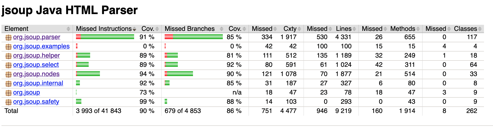

# Documentation de mes 10 Tests Unitaires

---
## Table des matières
- [Test#1](#Test#1)
- [Test#2-9](#Test#2-#9)
- [Test#10](#Test#10)

---
# Test#1
## Emplacement du Test - Methode close()
- **Visuel à partir de GitHub** : [Lien vers le test](https://github.com/Dietetics/jsoup/blob/5db594630b7972d015520a56f861c8d89d5170a2/src/test/java/org/jsoup/parser/myCharacterReaderTest.java)
- Path détaillé à partir de la racine de contenu: `src/test/java/org/jsoup/parser/myCharacterReaderTest.java`

Les tests pour la méthode `close()` se trouvent dans la classe `myCharacterReaderTest`, fichier `myCharacterReaderTest.java`. 
Le test particulier pour la branche `if (reader == null)` est documenté sous le nom `testClose_WhenReaderIsNull_ReturnsImmediately`.
- **`ce test utilise la bibliotheque java-faker`**

## Méthodes Testées
- **`close()`** : Cette méthode est testée pour garantir qu'elle fonctionne correctement dans plusieurs situations :
    - **Fermeture normale** : Le lecteur est fermé correctement après utilisation.
    - **Fermeture avec un lecteur nul** (Test discuté ici) : Ce cas s'assure que la méthode retourne immédiatement 
si le lecteur est déjà nul, garantissant que la méthode ne tente aucune action sur un état déjà clôturé.

## Justification
Nous testons la méthode `close()` pour nous assurer qu'elle ne lève pas d'exception lorsqu'elle est appelée avec un 
`Reader` null. Cela renforce la **robustesse** du code et sert de **documentation** utile pour d'autres développeurs 
qui interagiront avec cette partie du système. En somme, il s'agit d'une pratique essentielle pour maintenir un code de 
haute qualité, surtout dans un environnement collaboratif où les modifications sont fréquentes.

- **Robustesse** : Ce test garantit que le comportement du programme reste inchangé si quelqu'un modifie cette méthode 
- à l'avenir (par exemple, en supprimant accidentellement cette vérification). Cela assure que la méthode ne tente pas 
- de fermer un flux déjà null

- **Documentation par le test** : En écrivant ce test, nous fournissons une documentation vivante qui explique 
explicitement que la méthode close() doit gérer correctement l'état nul du Reader. 
Cela aide les autres développeurs à comprendre l'intention derrière cette vérification et à maintenir ce comportement 
lors de futures modifications. Le test agit comme un contrat : si quelqu'un modifie la méthode et enlève cette 
vérification, le test échouera, signalant qu'un comportement attendu a été altéré.

  
## Couverture 

- avant notre test 
- apres notre test 

---
# Test#2 a #9
## Emplacement des 8 Tests unitaires pour la Methode equals(Object o)

- **Visuel à partir de GitHub** : [Lien vers le test](https://github.com/Dietetics/jsoup/blob/yong/src/test/java/org/jsoup/parser/myTagTest.java)
- Path détaillé à partir de la racine de contenu: `src/test/java/org/jsoup/parser/myTagTest.java`

Les tests pour la méthode `equals(Object o)` se trouvent dans la classe `myTagTest`, fichier `myTagTest.java`.
2. test particulier pour la branche `if (!(o instanceof Tag)) return false;` est documenté sous le nom `testEquals_withDifferentObjectType`.
   - **`ce test utilise la bibliotheque java-faker`**
3. test particulier pour la branche `if (empty != tag.empty) return false;` est documenté sous le nom `testEquals_withDifferentEmptyFlag`.
4. test particulier pour la branche `if (formatAsBlock != tag.formatAsBlock) return false;` est documenté sous le nom `testEquals_withDifferentFormatAsBlockFlag`.
5. test particulier pour la branche `if (isBlock != tag.isBlock) return false;` est documenté sous le nom `testEquals_withDifferentIsBlockFlag`.
6. test particulier pour la branche `if (preserveWhitespace != tag.preserveWhitespace) return false;` est documenté sous le nom `testEquals_withDifferentPreserveWhitespaceFlag`.
7. test particulier pour la branche `if (selfClosing != tag.selfClosing) return false;` est documenté sous le nom `testEquals_withDifferentSelfClosingFlag`.
8. test particulier pour la branche `if (formList != tag.formList) return false;` est documenté sous le nom `testEquals_withDifferentFormListFlag`.
9. test particulier pour la branche `return formSubmit == tag.formSubmit;` est documenté sous le nom `testEquals_withDifferentFormSubmitFlag`.

## Raison des Méthodes Testées

### 1. `testEquals_withDifferentObjectType`
- **Objectif** : Vérifier que la méthode `equals()` retourne `false` lorsqu'elle est comparée à un objet d'un autre type (ici une chaîne de caractères).
- **Justification** : Il est essentiel que `equals()` ne retourne jamais `true` lorsque l'objet comparé n'est pas une instance de `Tag`. Cela garantit que la comparaison d'objets de types différents est sécurisée et prévient les erreurs dans le code.

### 2. `testEquals_withDifferentEmptyFlag`
- **Objectif** : Vérifier que deux instances de `Tag` avec des valeurs différentes pour le champ `empty` ne sont pas considérées comme égales.
- **Justification** : Le champ `empty` est un attribut important dans la définition d'un `Tag`. Ce test garantit que cet attribut est pris en compte dans la comparaison d'égalité, ce qui est crucial lorsque deux `Tag` semblent similaires mais n'ont pas les mêmes caractéristiques.

### 3. `testEquals_withDifferentFormatAsBlockFlag`
- **Objectif** : Tester que deux instances de `Tag` avec des valeurs différentes pour le champ `formatAsBlock` sont considérées comme non égales.
- **Justification** : Le formatage en tant que bloc est une propriété importante pour certaines balises HTML. Ce test garantit que la méthode `equals()` différencie correctement les `Tag` qui doivent être formatés en tant que blocs de ceux qui ne le sont pas.

### 4. `testEquals_withDifferentIsBlockFlag`
- **Objectif** : Vérifier que deux instances de `Tag` avec des valeurs différentes pour `isBlock` ne sont pas égales.
- **Justification** : `isBlock` définit si un `Tag` est considéré comme un élément de bloc dans le modèle HTML. Cette propriété impacte le rendu et la structure de la page. Ce test garantit que cette différence est correctement reflétée lors de la comparaison des `Tag`.

### 5. `testEquals_withDifferentPreserveWhitespaceFlag`
- **Objectif** : Tester que deux `Tag` avec des valeurs différentes pour le champ `preserveWhitespace` ne sont pas égaux.
- **Justification** : La préservation des espaces blancs est importante pour certains éléments, comme `<pre>`. Ce test garantit que cette différence est prise en compte lors de la comparaison de deux `Tag`.

### 6. `testEquals_withDifferentSelfClosingFlag`
- **Objectif** : Vérifier que deux instances de `Tag` avec des valeurs différentes pour `selfClosing` sont considérées comme non égales.
- **Justification** : Les balises auto-fermantes (`selfClosing`) sont une caractéristique importante dans le langage HTML (par exemple, ``). Ce test garantit que la méthode `equals()` différencie correctement les balises auto-fermantes des balises normales.

### 7. `testEquals_withDifferentFormListFlag`
- **Objectif** : Tester que deux `Tag` avec des valeurs différentes pour `formList` ne sont pas égaux.
- **Justification** : Le champ `formList` indique si le `Tag` appartient à une liste de formulaires. C'est une propriété spécifique qui doit être prise en compte dans la comparaison d'égalité pour éviter les erreurs lors de la gestion des balises dans des contextes de formulaire.

### 8. `testEquals_withDifferentFormSubmitFlag`
- **Objectif** : Vérifier que deux instances de `Tag` avec des valeurs différentes pour le champ `formSubmit` sont considérées comme non égales.
- **Justification** : Le champ `formSubmit` détermine si un `Tag` doit être soumis dans un formulaire HTML. Cette propriété doit être prise en compte pour garantir une comparaison correcte des `Tag` dans un contexte de soumission de formulaire.

## Conclusion

Les tests unitaires développés permettent de s'assurer que toutes les propriétés importantes de la classe `Tag` sont correctement évaluées lors de la comparaison d'égalité. Ces tests visent à renforcer la robustesse du code en garantissant que la méthode `equals()` prend en compte toutes les différences pertinentes entre deux objets de type `Tag`.

## Couverture

- avant nos tests 
- apres nos tests 

---
# Test#10
## Emplacement des 8 Tests unitaires pour la Methode equals(Object o)

---
# Couverture final 

- avant nos tests 
- apres nos tests 